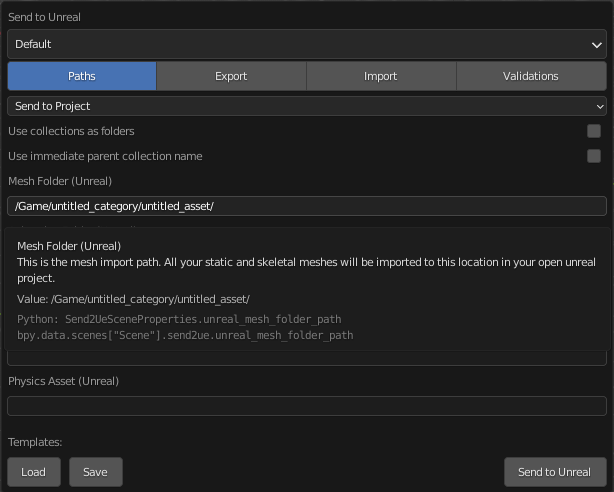

# Python API
Send to Unreal was designed to handle the generation of Unreal asset types. However, it does not handle every possible
scenario that your production might need. That is why the tool has a programmable python interface that allows the
user to set properties and to automate processes before and after the Send to Unreal operation.

## Properties
All of the properties can be accessed directly on the following scene data object in the blender API.
```python
bpy.context.scene.send2ue
```

::: tip Note
  This scene property data is persistent and stored within your blend file. If your blend file is saved,
then the state of your scene properties gets saved into the file as well.
:::

To find the name of the property you want to read or edit, you can use the blender python console and the tab key to list
the properties, or open the Send to Unreal Settings Dialog and hover on a property.  Under the tool tip you will see the API reference for
the desired property.




## Operators
Operators are just callable methods that have been registered in a submodule of the Blender API. The listed
operators should allow you to do anything that is possible to do from the Send to Unreal menu as well as the
Settings Dialog.

### Send to Unreal
Quickly send your assets to an open Unreal editor instance without a dialog,
```python
bpy.ops.wm.send2ue()
```

### Settings Dialog
Open the settings dialog to modify the tool properties,
```python
bpy.ops.wm.settings_dialog()
```

### Import Asset
Import a file that came from Unreal,
```python
bpy.ops.wm.import_asset()
```

### Create Pre-defined Collections
Create the predefined collections that are needed for data collection (Export).
```python
bpy.ops.send2ue.create_predefined_collections()
```

### Save Template
Saves the current state of the properties to the specified template file.
- param `str` `filepath` The full path of the template file.
```python
bpy.ops.send2ue.save_template(filepath: str)
```

### Load Template
Loads the specified template file into the template folder location.
- param `str` `filepath` The full path of the template file.
```python
bpy.ops.send2ue.load_template(filepath: str)
```

### Remove Template
Remove the settings template that is currently selected as active.
```python
bpy.ops.send2ue.remove_template()
```

### Reload Extensions
Reload the extensions files. If changes are made to the extension code, this should be called to reload the code.
```python
bpy.ops.send2ue.reload_extensions()
```

### Start RPC Servers
Bootstraps Unreal and Blender with RPC server threads so that they are ready for remote calls.
```python
bpy.ops.send2ue.start_rpc_servers()
```

## Examples

::: tip Change Template Example
  Here is how you could automate loading a settings template from a file and making it the active template.
```python
import bpy

# load the file into the template folder location
bpy.ops.send2ue.load_template(filepath=r'C:/some/file/path/my_template.json')

# set the active template which modifies the state of the properties
bpy.context.scene.send2ue.active_settings_template = 'my_template.json'
```
:::

::: tip Change Properties Example
  Here is how you could use Python to dynamically change the mesh import folder of your asset.
```python
import bpy

# set the mesh import folder
folder_name = some_custom_function_that_gets_a_folder_name()
bpy.context.scene.send2ue.unreal_mesh_folder_path = f'/Game/{folder_name}/'

# run send to unreal
bpy.ops.wm.send2ue()
```
:::


The same process can be used to dynamically set any property on the Send to Unreal tool.

