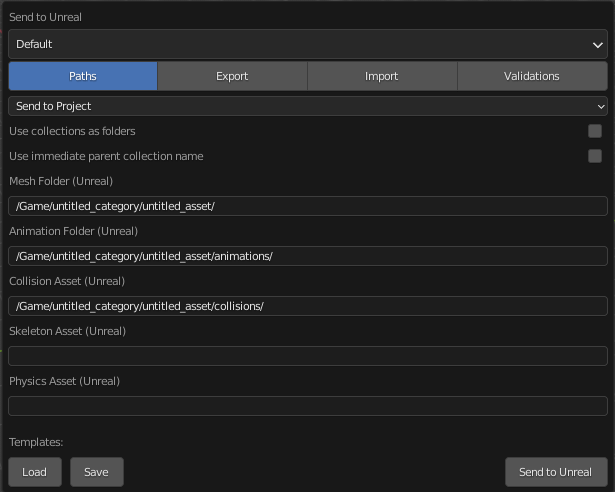

# Pipeline Menu

## Import

### Import Asset
`Pipeline > Import > Import Asset`

The Asset importer allows you to import assets then run a series of operations on them to fix them. The series
of operations run on the imported asset depends on what source application you select from the drop down. A source
application is the application the original file was generated in. Currently, the supported source applications are
Unreal Engine 4 and Unreal Engine 5.

After the selected FBX file is imported the imported action location f-curves are scaled up to a match the scene scale
factor with a scale of 1, the objects are applied with a scale factor of 1. The scaled keyframes on the root object
are removed, and the keyframes are rounded to the nearest integer based on the current frame rate.

## Export

### Send to Unreal
`Pipeline > Export > Send to Unreal`

This operator quickly sends your assets to an open unreal editor instance without invoking a dialog. The settings
used for the operation can be defined in the `Settings Dialog`.

### Settings Dialog
`Pipeline > Export > Settings Dialog`

This operator invokes a dialog that gives you access to the underlying scene data that the Send to Unreal operator uses.
The sending to unreal, saving templates, and loading templates can all be done in this interface.

## Utilities

### Create Pre-Defined Collections
`Pipeline > Utilities > Create Pre-Defined Collections`

Creates the pre-defined collection `Export` that is needed to collect asset data.

### Start RPC Servers
`Pipeline > Utilities > Start RPC Servers`

Bootstraps unreal and blender with rpc server threads, so that they are ready for remote calls. Unreal
must be open and `remote execution` enabled or this will fail.
