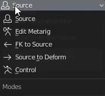

# Modes

<iframe src="https://www.youtube.com/embed/yDMt8FeXoe4" frameborder="0" allow="accelerometer; autoplay; clipboard-write; encrypted-media; gyroscope; picture-in-picture" allowfullscreen style="position: absolute; top: 0; left: 0; width: 100%; height: 100%;"></iframe>

Now that we understand what templates are, let's talk about how they're created. Templates are created in UE to Rigify
using five different modes:

These modes become available as soon as you select a "Source" rig.

::: tip Note
Your "Source" rig is the rig that you create in blender or the rig that you import into blender that has the skinned
to mesh attached to it. The idea of UE to Rigify is that you want to drive the "Source" rig with your "Control" rig.
:::

## Source

This mode is where you can see your original source rig.

## Edit Metarig

This mode is where you add or remove bones, edit bone positions, and edit the rigify bones types.

## FK to Source

This mode is where you edit the nodes that constrain your FK bones to the original source bones. These node links are needed if you want to transfer the existing animation from the ‘Source’ rig to the control rig.

## Source to Deform

This mode is where you edit the nodes that constrain your original source bones to the deformation bones on your ‘Control’ rig.

## Control

This mode is where you can control your new rig and animate.
